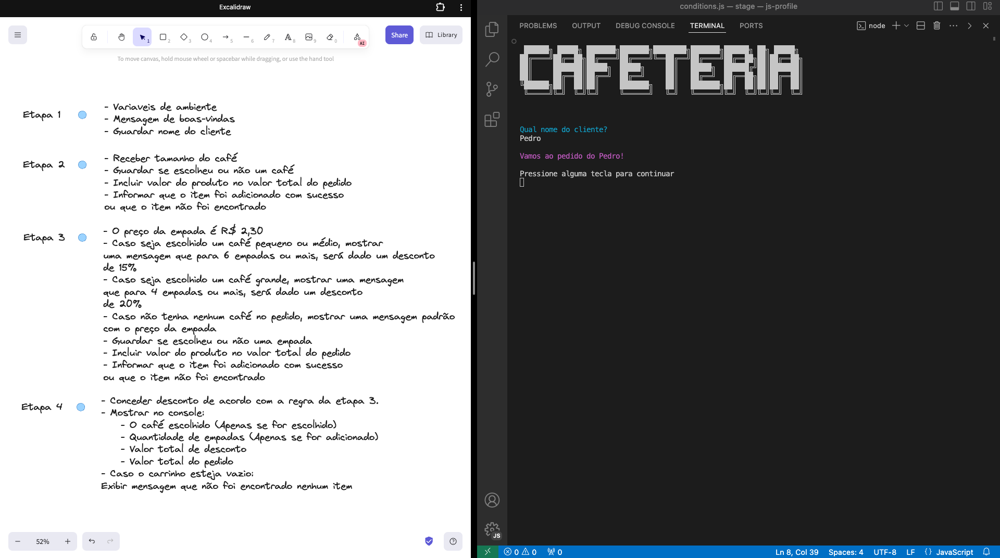

# console-cafeteria-frei
Programa do tipo console para gestão de cafeteria



### Cores ANSII

| Código ANSI | Cor do Texto  | Código ANSI | Cor de Fundo |
|-------------|---------------|-------------|--------------|
| ``  | Preto         | ``  | Fundo Preto  |
| ``  | Vermelho      | ``  | Fundo Vermelho |
| ``  | Verde         | ``  | Fundo Verde  |
| ``  | Amarelo       | ``  | Fundo Amarelo |
| ``  | Azul          | ``  | Fundo Azul   |
| ``  | Magenta       | ``  | Fundo Magenta |
| ``  | Ciano         | ``  | Fundo Ciano  |
| ``  | Branco        | ``  | Fundo Branco |

Além dessas cores básicas, existem códigos adicionais para formatos de texto:

- `` - Negrito
- `` - Sublinhado
- `` - Resetar (retorna ao padrão)


#### Exemplo
```js
const CIANO = '\x1b[36m%s\x1b[0m';
```
